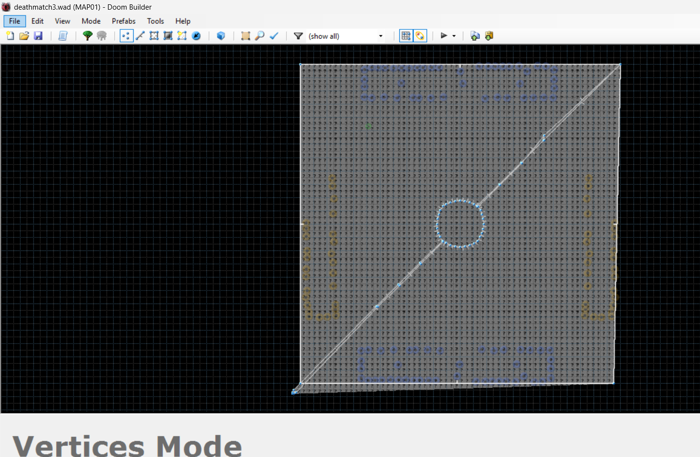

# Fall 2026 Paper Implementations

# Building Dynamic Behavioral Trees To Play DOOM Using Genetic Programming

## 📌 Project Summary
Behavior Trees are a common way to simulate the actions of AI in video games, which work as slightly more complex decision trees that allow things such as taking multiple actions at once or performing actions in a sequence. Nowadays they are used much more than their predecessor for deciding actions, that being finite state machines.

However, one issue with behavior trees (and FSMs too, along with symbolic AI in general) is that how well they do ends up being entirely dependent on how well the person is able to design the structure behind the tree - this means its possible for a human to design a tree that doensn't fully capture the best that the AI can do in its environment.

This is where this project comes in, which builds behavior trees dynamically, by basically having mutliple generations of randomly created behavior trees. These trees are created by selecting from a pool of conditions that serve as checks / branch points, and then actions that serve as actions the AI takes that are the leaves of the tree. Then, each tree plays the game and gains rewards/punishments for doing well, which are summed up at the end of the generation. Then, the ones that did best get to 'survive' into the next generation, while also having the possibility to 'mutate' or 'reproduce'. Eventually, the idea is that statistically the trees will die off and new trees will come in such that the remaining ones are ones proven to 'survive' in that environment, aka being quite effective binary trees.

In this case, I am building a behavior tree to play a game of deathmatch (surviving waves of monsters) in VizDOOM, which is an API that has Doom scenarios and allows you to put in custom scenarios as well so that you can train DOOM bots.

## 🎯 Motivation
I really wanted to try something with genetic programming, and I also wanted to learn a bit more about behavior trees and how they're implemented since my research topic will involve AI in games, so coming across this paper seemed like a really good first starting point for the first implementation. Additionally, I chose to do DOOM for the game cause I thought it would be cool. 

## 🧩 Novelty
The main novelty in the paper itself is how it uses something it called 'dynamic constraints' to avoid a problem with the initial approach of using GP for Behavior Trees.

GP has this feature for behavior trees called 'crossover', which is where you take 2 trees and swap 2 random subtrees between them (where those subtrees keep all their children). However, it turns out that this can be a problem because sometimes the subtree that is swapped over was part of a really good / effective subtree, and thus swapping it out for a new set of nodes underneath esssentailly breaks the logic that made the subtree work well.

How the paper fixes this isssue is by introducing a dynamic constraint where after each run in a generation it uses FREQT on the highest scoring Behavior Trees, which looks at all the subtrees within the behavior trees and finds the most common ones. Then, it lowers the probability of these nodes being chosen for crossover. The idea is that it assumes since these subtrees were frequent within the most common trees, they must be 'good' subtrees that shouldn't be broken apart in any way, so it lowers the probability of such a thing happening.

It also had a 'static constraint' that basically made the BT follow certain rules that constrained the size of it so it wouldn't explode, but this wasn't something i implemented.

Additionally, as for the novelty I introduced, they originally tested their new methodology using the game Pac-Man, meanwhile I decided to test it by doing it on the game Doom instead since it'd be cooler.

## 🧠 Methodology
1. **Environment Construction**:

One of the hardest parts was actually just getting the ideal environment to test the game in set up. The main issue was that VizDOOM came with only a few default scenarios, and of these I chose the Deathmatch one, where they're placed into an arena with a bunch of resources where enemies also get to spawn, and it basically has to try and survive for as long as possible while killing as many enemies as possible.

The main issue was that I wanted the player to spawn in with certain weapons, and to have the map open without walls between the player and resources unlike the default scenario. So for this what I had to do was actually install a Doom map editor, and physicallly remove the walls, as well as write a game scrip to give the player guns on startup. An issue I then ran into ws that this script would seem to override the control logic script VizDOOM had for the deathmatch scenario meaning all the other things like enemies spawning wouldn't work, so then I had to use a decompiler to get what the original Deathmatch code was like so that it could be added back in manually (thank god for Claude, I asked ChatGPT to decompile it initially but it kept being stupid). In the end though I was finally able to get the environment set up as I'd like, after learning a great deal about how Doom map design works lol.

2. **Behavior Tree Setup**:
Setting up the behavior tree itself was not too bad, I just had to define a tree system which I was able to do since I'd taken Data Structures. Then though, I had to define ALL the conditions and actions that would be possible myself, and boy that took a really long time. Conditions weren't so bad since it was just looking at the game state and looking at certain values for variables in that state, but for actions I had to create a system to press the right inputs and the right time and also determine when the action was complete, it was not exactly fun. For example for "Fire And Strafe", I had to make a system to find the angle at which the player was from the closest enemy, determine how to turn to make that angle smaller, and also determine what WASD keys should be pressed so that they'd be moving to the side of the enemy. Basically Geometry SUCKS.

Creating the system to go through the tree evaluating conditions and seleccting an action wasn't too bad, I could just decide what child to go down based on the current node condition's value, and stop when I reached an action.

3. **Implementing Genetic Programming**:
This part was surprisingly not the hardest part. I had to do some research and thinking into how the GP side would work primarily; mutation was decently easy, and so was finding the best trees as I could sort the trees by score. For this aspect the most difficulty came from crossover, as I had to make sure the exact same subtrees weren't selected, make sure the 2 subtrees aren't from the same exact tree, reduce the probability of the crossover based on how far in depth the subrrees were (to make sure we wouldn't have abnormally short or long trees), and also reduce the prbability based on the dynamci constraint.

To take care of that dynamic constraint actually, what I did was use soemthing called a 'Canonical Representation', where I would capture each unique subtree by storing the (nodeval, left, right) as the value for that subtree, where the "left" and "right" values would actually be filled in versions of recursively doing the same call on the left and right children of the root of the current subtree. Turns out this lets you compare subtreesperfectly surprisingly, it's like really really cool. But then we can see the count of each subtree with a hashmap, and if the count is above a predefined threshold, we can then mark all the nodes within that subtree (besides the root) as 'protected', so if we ever try to do a crossover involving those nodes then their probability is reduced.

4. **Results And Evaluation**:
For evaluating results, what I did was at the end of the final generation, take the top 3 trees, print out their structure, and then save them to files. Then, the "testTree" file lets you play with those trees. I forgot to print the scores, but here is an example of a behavior tree's struture:
[COND] chaingunEquipped?
  T:
    [COND] lowAmmoCurrent?
      T:
        [COND] highHealth?
          T:
            [COND] armorNearby?
              T:
                [COND] lowHealth?
                  T:
                    [COND] manyEnemies?
                      T:
                        [ACTION] switchWeapon
                      F:
                        [ACTION] fireAndStrafe
                  F:
                    [COND] lowTimeRemaining?
                      T:
                        [ACTION] goToArmor
                      F:
                        [ACTION] fireAndStrafe
              F:
                [COND] healthNearby?
                  T:
                    [COND] highArmor?
                      T:
                        [ACTION] switchWeapon
                      F:
                        [ACTION] directlyFlee
                  F:
                    [COND] someRangedEnemy?
                      T:
                        [ACTION] goToHealth
                      F:
                        [ACTION] goToAmmo
          F:
            [COND] ammo3Nearby?
              T:
                [COND] lowHealth?
                  T:
                    [COND] ammo4Nearby?
                      T:
                        [ACTION] directlyFlee
                      F:
                        [ACTION] chargeIn
                  F:
                    [COND] noEnemies?
                      T:
                        [ACTION] goToArmor
                      F:
                        [ACTION] switchWeapon
              F:
                [COND] mediumArmor?
                  T:
                    [COND] manyEnemies?
                      T:
                        [ACTION] directlyFlee
                      F:
                        [ACTION] goToHealth
                  F:
                    [COND] mediumHealth?
                      T:
                        [ACTION] moveRandom
                      F:
                        [ACTION] directlyFlee
      F:
        [ACTION] switchWeapon
  F:
    [COND] mediumArmor?
      T:
        [COND] manyEnemies?
          T:
            [COND] mediumHealth?
              T:
                [COND] highArmor?
                  T:
                    [COND] lowAmmoCurrent?
                      T:
                        [ACTION] switchWeapon
                      F:
                        [ACTION] directlyFlee
                  F:
                    [COND] lowAmmoCurrent?
                      T:
                        [ACTION] directlyFlee
                      F:
                        [ACTION] fireAndStrafe
              F:
                [COND] nearbyEnemy?
                  T:
                    [ACTION] fireAndStrafe
                  F:
                    [COND] ammo3Nearby?
                      T:
                        [ACTION] directlyFlee
                      F:
                        [ACTION] switchWeapon
          F:
            [ACTION] directlyFlee
      F:
        [COND] recentlyHurt?
          T:
            [COND] lowAmmoCurrent?
              T:
                [COND] lowHealth?
                  T:
                    [COND] manyEnemies?
                      T:
                        [ACTION] fireAndStrafe
                      F:
                        [ACTION] runAway
                  F:
                    [COND] lowTimeRemaining?
                      T:
                        [ACTION] fireAndStrafe
                      F:
                        [ACTION] fireAndStrafe
              F:
                [COND] noEnemies?
                  T:
                    [COND] highArmor?
                      T:
                        [ACTION] directlyFlee
                      F:
                        [ACTION] goToArmor
                  F:
                    [COND] mediumHealth?
                      T:
                        [ACTION] goToHealth
                      F:
                        [ACTION] goToHealth
          F:
            [COND] lowTimeRemaining?
              T:
                [COND] ammo4Nearby?
                  T:
                    [COND] ammo3Nearby?
                      T:
                        [ACTION] goToArmor
                      F:
                        [ACTION] runAway
                  F:
                    [COND] nearbyEnemy?
                      T:
                        [ACTION] fireAndStrafe
                      F:
                        [ACTION] chargeIn
              F:
                [COND] mediumHealth?
                  T:
                    [COND] someRangedEnemy?
                      T:
                        [ACTION] moveRandom
                      F:
                        [ACTION] switchWeapon
                  F:
                    [COND] lowHealth?
                      T:
                        [ACTION] goToArmor
                      F:
                        [ACTION] goToArmor

One thing is it does look a bit bloated and in general some of the logic doesn't make sense, but some of it does. For example, you can see for the nearbyEnemy condition, if there is one nearby it will fire at it, otherwise it will try to charge wherever they are, which makes sense. However, there is also weird stuff, like the condition  near the top where if there's many enemies it will try tos witch enemies, which is weird.

When playing with the trees though it's a bit unusual, it looks like it doesn't actually end up firing its gun often and it just tries to run awaound in circles often. I think this might be an issue with the movement but I'm not entirely sure, this is something I'll look into later.

Another change I'd like to make is adding more generations, as it actually turns out you may want around 20 or more generations to run though instead of a measly 5. Overall the results show that it's learning something, but a lot of tuning can still be done.

#### Additional Methodology:
- **Something optional**: Sentence

## 🌍 Impact
This project will allow game designers to design better systems for AI in games, especially when they may be unsure of how to design an AI in such an environment. They can just specify
the possible conditions that can be checked, what actions can be taken, and any other constraints that may be needed, and then see how different combinations of behavior trees can cause differnet results which eventually converge in the 'ideal' behavior tree. This does so in a way that makes sure 'good' subtrees are usually not destroyed as well.

This project in particular has the impact of showing how the project can be adapted to more complex scenarios. While before it was just for Pac Man, this project shows how it can still be adapted to even 3D gaems without necessarily needing vision as input either.

#### Future Work
A couple things can be done to improve the project. First, the quality of the behavior tree itself can be improved. Right now, we have it so that each internal node is a binary conditioin that can branch to eitehr 'yes' or 'no', and the leaf nodes represnet a single action. Howver, Behavior Trees can be much more complex, and there's at least 3 things we can add among many others. First is a internal node that has children as a bunch of actions taht functions as an 'OR' loop, where it will try to run all those actions until one of them completes. Another is a Sequential node that, when fired, runs actions in a sequence that only finishes when the last action finishes. Finally, another thing is normally in behavior trees when an action finishes, instead of re-running the behavior tree starting at the root (like my version does), instead normally behavior trees will go to the last completed action's parent and then check if it needs to continue percolating upwards or not, keeping the behavior tree 'defined' within a certain area still.

Moving away from the behavior tree, it'd also be nice to try to adapt this to other games besides DOOM and games that require a great deal more of complexity, as it would be interesting to see how they do. However, the main limitation behind this is finding a game for which ti will work - i was only able to do Doom thanks to the open source library that did all the game engine stuff for me.

Finally, it may be interesting to try to further expand on the GP side of things. One thing I'd like to do is change the dynamic constraint so instead of picking common subtrees, it picks trees that overall perform effectively instead, which can be say evaluatied by something like summing up the scores of all the actions within that subtree or similar. It may also be more interesting to just look further into the GP side in general.

**Additional Sources:**
- The actual paper: https://www.mdpi.com/2076-3417/8/7/1077
- VizDoom Library: https://vizdoom.farama.org/

**Setup Guide:**
First, you have to install 2 python libraries. First is vizdoom (which is for DOOM and its api), and second is numpy. You can install these with the command "pip install numpy vizdoom".

After this, just run "deathmatchGame.ipynb" (you can set variables you'd like to change in constants.py), wait for it to finish, and then run testTree.ipynb to see how the trees perform. That should be it I think.