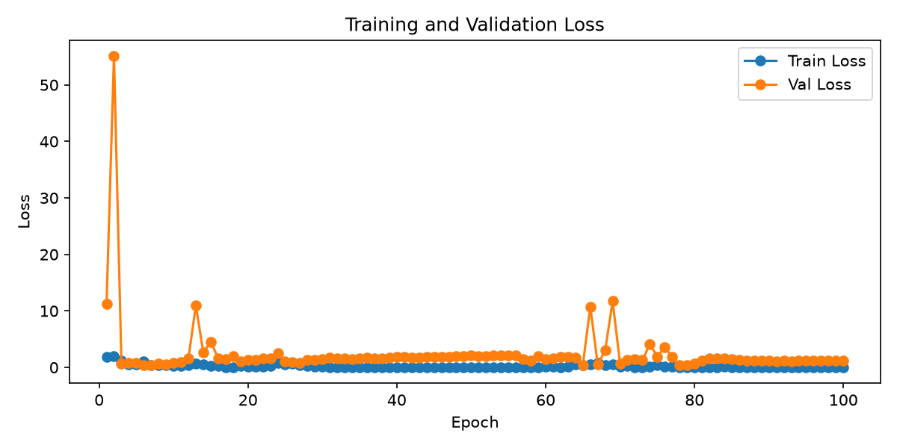

ACM Research Banner Light

# Data Center Environmental Impact Classification via Multi-Spectral Satellite Imagery

## 📌 Project Summary

This project builds a vision classifier to predict the energy-impact tier of data center buildings from multi-spectral satellite imagery alone — without relying on building permit records or floor-area data at inference. The pipeline ingests Virginia county building records, extracts five-band Sentinel-2 imagery (RGB + NIR + SWIR) for each building footprint via Google Earth Engine, and trains a modified ResNet-34 CNN to classify each site into one of three power-demand tiers: Low (Enterprise/Edge, < 20 MW), Medium (Colocation, 20–90 MW), and Large (Hyperscale, > 90 MW).

## 🎯 Motivation

Data centers account for a rapidly growing share of global electricity consumption, yet their energy footprints are largely guarded from public view. Administrative building records (gross floor area, zoning classifications) exist and are public, but they only describe the envelope — not the operational load. By learning a visual signature from satellite imagery correlated with floor-area-derived power estimates, this project explores whether deep learning models can serve as a scalable, low-latency proxy for energy-impact assessment — useful for grid planning, environmental review, and infrastructure forecasting.

## 🧩 Novelty

- **5-channel geospatial input adaptation**: Standard ImageNet-pretrained ResNet-34 (3-channel RGB) is extended to accept 5-channel Sentinel-2 tiles (Red, Green, Blue, NIR, SWIR) by rebuilding `conv1` with RGB weights transferred and the two additional channels initialized to the per-filter RGB mean — preserving pretrained representations while enabling spectral generalization.
- **GFA-to-MW label proxy**: Ground-truth labels are derived programmatically from public floor-area records (`Est_MW = MaxGFA × 150 / 1,000,000`) rather than metered consumption data, making the labeling pipeline fully reproducible without proprietary energy data. This serves as a heuristic benchmark for a facility's energy consumption. 

## 🧠 Methodology

1. **Dataset**: [Virginia Data Center Buildings](https://data.virginia.gov/dataset/data-center-buildings) — county building permit records for ~55 completed data center sites. Each record contains gross floor area (GFA) columns used to estimate MW demand and assign a 3-class tier label. Five-band 128×128 pixel Sentinel-2 tiles (`tile_{OBJECTID}.npy`) are extracted per building's geolocation via Google Earth Engine and stored in GCS.
2. **Architecture**: `DataCenterVisionNet` — ResNet-34 backbone adapted for geospatial imagery
  - Input: `(batch, 5, 128, 128)` float32 tensors (Sentinel-2 bands: R, G, B, NIR, SWIR)
  - `conv1` rebuilt from 3→5 channels; extra channel weights initialized as RGB mean
  - Fully connected head replaced: `Linear(512 → 3)` for 3-class impact tier output
  - ImageNet pretrained weights used for the RGB portion of `conv1` and all deeper layers
3. **Evaluation**:
  - Stratified 80/20 train/validation split (per-class, `random_state=42`)
  - Inverse-frequency class weighting in `CrossEntropyLoss` to compensate for severe imbalance (6 / 45 / 4 across tiers)
  - Per-epoch train and validation loss tracked; final validation confusion matrix generated
4. **Metrics**:
  - Cross-entropy loss (train and validation, per epoch)
  - Validation confusion matrix over 3 impact tiers
  - Artifacts saved per run: `model.pth`, `metrics.json`, `metrics.csv`, `loss_curve.png`, `confusion_matrix.png`

#### Latest Training Job

**Hyperparameters**

| Parameter     | Value                        |
| ------------- | ---------------------------- |
| Epochs        | 100                          |
| Batch size    | 4                            |
| Learning rate | 0.001                        |
| Train samples | 44                           |
| Val samples   | 11                           |

**Results**

| Metric           | Value     |
| ---------------- | --------- |
| Final train loss | 0.0011    |
| Final val loss   | 1.2485    |
| Overall accuracy | **81.8%** |
| Macro precision  | 0.630     |
| Macro recall     | 0.630     |
| Macro F1         | 0.630     |

**Per-Class Validation Metrics**
| Class                 | Precision | Recall | F1    | Support |
| --------------------- | --------- | ------ | ----- | ------- |
| Low (Enterprise/Edge) | 0.000     | 0.000  | 0.000 | 1       |
| Medium (Colocation)   | 0.889     | 0.889  | 0.889 | 9       |
| Large (Hyperscale)    | 1.000     | 1.000  | 1.000 | 1       |

Training loss converges in training. However, validation loss oscillates indicating the model struggles to generalize for unseen data. Moreover, as there are only 11 samples in validation set, it's difficult to use this model for reliable predictions. This model needs significantly more data to understand strengths and limitations of this vision model.

## 🌍 Impact

Utility companies, environmental regulators, and urban planners currently lack a scalable way to estimate the energy demand of candidate data center sites before construction or grid interconnection studies begin. Most crowd-contributed activist initiatives require manual data collation and reporting, which takes place at a scale slower than most data center projects are proposed for construction. A satellite-based classifier enables rapid, passive screening of sites at scale — anywhere imagery is available — without requiring access to confidential energy contracts or proprietary metering data. If generalized beyond Virginia, the approach could support grid-capacity forecasting and environmental impact assessment across data center corridors in the US and internationally.

#### Future Work

- **Larger dataset**: The current 55-sample dataset severely limits model generalization; expanding to national or global data center registries. Another limitation with the existing dataset is that most data centers in Prince William County are located in close proximity with one another. This results in satelite imagery having overlapping features from distinct data centers. This also limits the generalizability of this model.
- **Temporal multi-image input**: Stacking Sentinel-2 tiles across multiple dates (seasonal variation, construction timelines) as additional channels could improve discrimination between tiers.
- **Binary simplification**: Tier 0 (Low, 6 samples) may need to be merged with Tier 1 or dropped for a production binary classifier (Colocation vs. Hyperscale) until more low-tier samples are available.

**Additional Sources:**

- [Sentinel-2 MSI: MultiSpectral Instrument, Level-2A — Google Earth Engine](https://developers.google.com/earth-engine/datasets/catalog/COPERNICUS_S2_SR_HARMONIZED)
- [ResNet: Deep Residual Learning for Image Recognition (He et al., 2015)](https://arxiv.org/abs/1512.03385)
- [Virginia Data Center Buildings Open Dataset](https://data.virginia.gov/dataset/data-center-buildings)
- [Google Vertex AI Custom Training](https://cloud.google.com/vertex-ai/docs/training/overview)