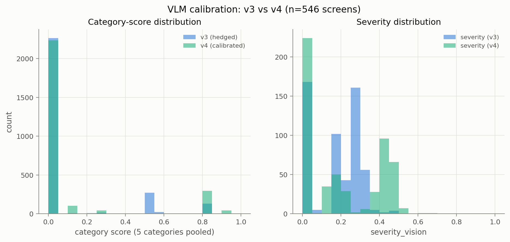

# Fall 2026 Paper Implementations

# Lighthouse - Catching Dark Patterns in UIs

Iteration 3 README below. Iterations 1 and 2 have their READMEs in their own folders.

## 📌 Project Summary
Dark patterns are interface design techniques that steer users toward actions that benefit the site operator rather than the user, such as fabricated scarcity warnings ("only 2 left!"), countdown timers, guilt-framed decline buttons ("No thanks, I hate saving money"), and preselected checkboxes.

Lighthouse asks whether a model can not only detect these patterns automatically but also quantify how manipulative a screen is, and whether that quantity predicts real changes in user behavior. The project has proceeded in three iterations. Iteration 1 built a text-based detector: OCR extracts the readable strings from a screenshot, and a frozen DistilBERT classifier produces presence scores for five dark-pattern categories (urgency, scarcity, social proof, guilt wording, and other). Iteration 2 added a vision-language model (Qwen2-VL-7B) that scores the raw screenshot directly, and demonstrated on a 546-screen corpus that vision detects visual manipulations that are invisible to a text pipeline.

Iteration 3, documented here, moves the project from detection to measurement. Each screen now receives a single severity score derived from behaviorally grounded category weights; prevalence and potency are mapped jointly across the full corpus for the first time, and a behavioral experiment has been built/prepared, ready to test whether the model's severity score predicts measured decision changes in human participants. This iteration also corrects a calibration weakness identified in iteration 2 — the vision model's tendency to assign uncertain scores a default value of 0.50 — through a controlled prompt modification.

## 🎯 Motivation
Detection alone is largely a solved problem, as AidUI and UIGuard already flag dark patterns in screenshots. What the literature lacks is the next step; a per-screen measure of how manipulative an interface is, and evidence that the measure predicts behavior. A researcher or regulator auditing thousands of sites needs a ranking instead of  another binary flag, and a ranking is only meaningful if the score behind it is validated against actual user decisions. Iterations 1 and 2 established the detection foundation, and iteration 3 builds the severity measure and the experimental apparatus needed to validate it.

## 🧩 Novelty

- **A severity score**: Detection papers stop at "a dark pattern is present." We collapse the five per-category scores into one severity value per screen using potency weights derived from Luguri & Strahilevitz's behavioral findings. The aggregation is noisy-OR, so a single potent pattern alone scores high and stacked patterns compound with diminishing returns. To my knowledge, no prior research outputs a behaviorally weighted manipulation score per screen.
- **Prevalence and potency on one corpus**: Mathur et al. measured how frequently dark patterns appear, and Luguri & Strahilevitz measured how strongly each affects behavior. No prior work has placed both axes on the same corpus. This iteration does so on 546 screens, and the two axes disagree: the web's most prevalent manipulation is not its most effective one.
- **The score-to-behavior link**: The fall experiment regresses measured decision change on the model's pre-registered severity score. A model score predicting a behavioral effect out of sample is the central claim of the project, and this iteration built and validated the complete tool for testing it.

## 🧠 Methodology
1. **Dataset**: The same 546-screen corpus as iteration 2, [CONTEXTDP](https://github.com/SageSELab/AidUI) with 501 labeled screenshots plus our hand-curated 45. Both frozen detectors score every screen from iteration 2's cache. Text scores are untouched, and vision was re-scored once with the calibrated v4 prompt described below.
2. **Architecture**: Three new pieces sit on top of the frozen detectors.
   - **Severity score**: `severity = 1 − Π(1 − w_c · s_c)` over the five category scores. The weights interpolate the Luguri & Strahilevitz potency ordering onto the 0 to 1 range. Because this mapping is an assumption, every result is also computed under an alternate weight vector with `other` at 0.9 instead of 0.5, and any conclusion that changes under the alternate weights is reported. Weights are frozen and never tuned on results.
   - **Calibration fix (prompt v4)**: Iteration 2 found that the vision model perceives visual-only patterns but assigns uncertain cases a default score of exactly 0.50, compressing the signal into the lower half of the range. The v4 prompt is identical to the frozen v3 except for one added block that forces commitment: no evidence of a pattern means 0.1 or lower, a nameable manipulative element means 0.8 or higher, and 0.5 as a default is explicitly prohibited. The change was gated on a 25-screen development subset before the full run, and the v3 results remain frozen as the baseline.
   - **Behavioral apparatus**: A Flask instrument shows each participant one version of each of 10 stimulus screens, either manipulated or neutralized, and records the decision. The model itself selects the stimuli by severity, binned and seeded, with hard constraints ensuring that guilt-wording and purely visual screens are represented. Selection occurs before any behavioral data is collected, making the regression a genuine out-of-sample test rather than a fit to hand-picked examples.
3. **Evaluation**:
   - Calibration is scored v3 against v4 on the same screens with a pre-stated guardrail, hedging must drop while accuracy against ground truth holds.
   - The apparatus is validated end to end with fake participants that respond with a known planted effect. An analysis pipeline that cannot recover a known effect cannot be trusted to measure one in human data.
   - Prevalence uses ground-truth labels as the primary axis, with detector-based prevalence shown alongside since neither detector is an unbiased estimator.
4. **Metrics**:
   - Hedge mass (share of scores at or near 0.5), severity spread, per-category precision, recall, and F1, is_dark accuracy, and regression slope, R², and p for the planted-effect recovery.

| category | potency weight | alt | ground-truth prevalence (n=546) |
|---|---|---|---|
| urgency | 0.2 | 0.2 | 9.3% |
| scarcity | 0.3 | 0.3 | 4.9% |
| social_proof | 0.5 | 0.5 | 2.9% |
| guilt_wording | 0.6 | 0.6 | 2.2% |
| other | 0.5 | 0.9 | 37.5% |

### Results

**1. The calibration fix succeeded without an accuracy cost.**

| metric | v3 (hedged) | v4 (calibrated) |
|---|---|---|
| score mass at or near 0.5 | 10.0% | **0.1%** |
| severity_vision std | 0.121 | **0.191** |
| severity_vision max | 0.499 | **0.688** |
| macro-F1 vs ground truth (guardrail) | 0.345 | **0.368** |
| parse failures (546 screens) | — | **0** |

The model went from hedging one in ten scores to committing on essentially all of them. Severity decompressed into a usable range, and accuracy against human labels rose slightly, so the added confidence did not come at the cost of correctness. Four of five categories improved; the `other` category traded recall for precision and is addressed under future work.

**2. Prevalence and potency diverge.** The `other` bucket — largely preselected defaults and nagging — appears on 37.5% of screens but carries mid-tier potency, while guilt wording, the highest-potency category, appears on only 2.2%. If sites deployed manipulations in proportion to their effectiveness, the prevalence–potency map would slope upward; it does not. Under the alternate weights the potency ranking flips and `other` ranks highest, so this claim is always stated per weight vector. Two additional observations: our 12 guilt-wording screens remain the only labeled examples of that pattern in any dataset, and 192 category detections fire for vision but not text, confirming at dataset scale the vision-only blind spot that iteration 2 identified on the smaller curated set.

**3. The experimental apparatus is validated.** I planted an effect of 0.5 and passed it through the full instrument path, the same storage and analysis code that human participants will use. The regression recovers it decisively.

| regressor | slope | R² | p |
|---|---|---|---|
| severity_vision (primary) | 0.460 | 0.928 | 7.4e-06 |
| severity_text (robustness) | 0.322 | 0.551 | 0.014 |
| severity_vision_alt (weight sensitivity) | 0.340 | 0.779 | 7.1e-04 |

⚠ *Synthetic participants with a planted effect. This validates the apparatus, not any hypothesis about people. Every synthetic output is watermarked as such, driven off a `source` column in the data.*

## 🌍 Impact
A validated severity score moves dark-pattern research from counting to ranking and increased insight. Regulators can audit the most harmful screens first, browser tools can warn in proportion to harm, and researchers gain a behaviorally grounded measure in place of a binary flag. The prevalence–potency map is also the first evidence on this corpus that the web over-deploys weak manipulations and under-deploys strong ones, which is a finding about the ecosystem as a whole rather than about individual screens.

#### Future Work
- **Neutralized stimuli**: The 10 experiment screens are selected and locked. Their neutralized counterparts — the same screen with the manipulation removed — remain to be produced, and are the final artifact required before human data collection.
- **Run the human experiment**: The apparatus is validated and ready. With real participants, the synthetic regression above becomes the project's primary result, a test of whether the model's severity score predicts measured behavioral change.
- **Decompose the other bucket**: It covers 37.5% of the corpus under a single label, spanning preselection, nagging, and disguised ads. It is where the potency-weight assumption is weakest and where detector recall declined after calibration. Sub-categorizing it would sharpen both the weights and the score.
- **Smooth the score scale**: The calibrated model favors round values such as 0.8 and 0.9, so severities cluster on a small number of levels. This is adequate for the experiment's binned selection, but prompt-variant averaging or logit calibration would be needed before severity is used as a continuous measure.

**Additional Sources:**
- Mansur et al., *AidUI: Toward Automated Recognition of Dark Patterns in User Interfaces* (2023), CONTEXTDP dataset
- Mathur et al., *Dark Patterns at Scale* (2019)
- Luguri & Strahilevitz, *Shining a Light on Dark Patterns* (2021)
- Yada et al., *Dark Patterns in E-commerce: a dataset and baselines* (2022)
