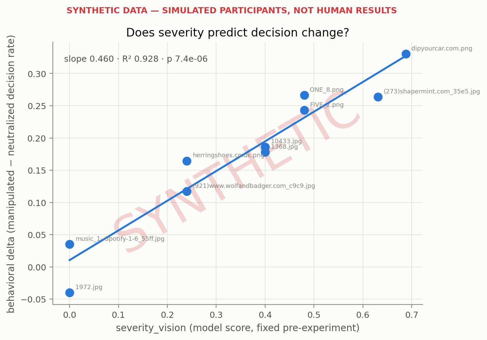

> ⚠ **SYNTHETIC DATA — SIMULATED PARTICIPANTS, NOT HUMAN RESULTS**
>
> Responses were generated by `src/synthetic_participants.py` with a planted effect; this report validates the apparatus, not any hypothesis about people.

# Severity vs behavior

Generated 2026-07-19 19:34 · 8000 responses ({'synthetic': 8000}) · 8000 used across 10 screens

Per screen: behavioral delta = decision rate under the manipulated screen minus under its neutralized counterpart. The delta is regressed on the screen's severity score (fixed before any behavior was collected).

## Regressions

| regressor | role | slope | R² | p | n screens |
|---|---|---|---|---|---|
| severity_vision | **primary** (the claim under test) | 0.460 | 0.928 | 7.4e-06 | 10 |
| severity_text | robustness (text modality) | 0.322 | 0.551 | 0.014 | 10 |
| severity_vision_alt | weight sensitivity (other=0.9) | 0.340 | 0.779 | 0.00071 | 10 |

## Per-screen deltas

| screen_id | severity_vision | rate manip | rate neutral | delta | n manip | n neutral |
|---|---|---|---|---|---|---|
| 1972.jpg | 0.000 | 0.267 | 0.307 | -0.040 | 367 | 433 |
| music_1--Spotify-1-6_55ff.jpg | 0.000 | 0.323 | 0.288 | +0.035 | 390 | 410 |
| herringshoes.co.uk.png | 0.240 | 0.435 | 0.271 | +0.164 | 423 | 377 |
| (921)www.wolfandbadger.com_c9c9.jpg | 0.240 | 0.415 | 0.298 | +0.117 | 417 | 383 |
| 1368.jpg | 0.400 | 0.504 | 0.326 | +0.178 | 407 | 393 |
| 10433.jpg | 0.400 | 0.492 | 0.306 | +0.186 | 392 | 408 |
| ONE_8.png | 0.480 | 0.538 | 0.271 | +0.266 | 424 | 376 |
| FIVE_2.png | 0.480 | 0.531 | 0.288 | +0.243 | 401 | 399 |
| (273)shapermint.com_35e5.jpg | 0.631 | 0.593 | 0.329 | +0.264 | 393 | 407 |
| dipyourcar.com.png | 0.688 | 0.656 | 0.326 | +0.330 | 404 | 396 |

## Reading the result

- Primary: severity_vision predicts the behavioral delta (slope 0.460, p 7.4e-06).
- The text-severity robustness check agrees in sign (slope 0.322, p 0.014).
- Under the alt potency weights the slope is 0.340 (p 0.00071) — conclusions are stable across the weight choice.

> ⚠ **SYNTHETIC DATA — SIMULATED PARTICIPANTS, NOT HUMAN RESULTS**
