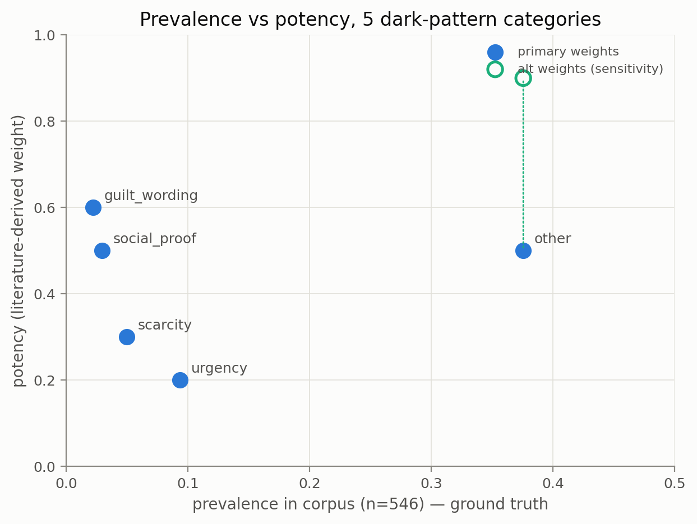

# Prevalence vs potency

Corpus: 546 screens (CONTEXTDP 501 + own 45) · detection threshold 0.5 · generated 2026-07-19 05:43

Prevalence (primary) = fraction of screens whose **ground-truth** labels include the category; detector-based prevalences are shown alongside (text over-fires and vision under-fires social_proof, so neither is an unbiased prevalence estimate). Potency = literature-derived weight from the Luguri & Strahilevitz (2021) ordering — an assumption, not a measurement (see caveats).

## Caveats (read first)

- **Prevalence here is prevalence in this corpus (n=546), not on the web.** CONTEXTDP is a curated evaluation set roughly half non-dark by construction, and the own 45 were deliberately stratified; these counts do not estimate real-world frequency.
- **`other` in this corpus is mostly preselection and nagging** (CONTEXTDP: DEFAULT CHOICE 111, NAGGING 57, DISGUISED ADS 21, ATTENTION DISTRACTION 13, GAMIFICATION 11), NOT the hidden-information / obstruction / trick-question patterns Luguri & Strahilevitz found most potent. Its primary weight (0.5) is a floor-level assumption for what the bucket actually contains; the alt vector (0.9) shows what the naive L&S mapping would claim.
- The map has 5 points and its potency axis is an ordinal literature ranking mapped to [0,1]; it is descriptive — no correlation statistic would be meaningful at n=5.

## Table

| category | potency | potency_alt | prev_gt | n_gt | prev_text | prev_vision |
|---|---|---|---|---|---|---|
| urgency | 0.200 | 0.200 | 0.093 | 51 | 0.308 | 0.269 |
| scarcity | 0.300 | 0.300 | 0.049 | 27 | 0.126 | 0.165 |
| social_proof | 0.500 | 0.500 | 0.029 | 16 | 0.121 | 0.115 |
| guilt_wording | 0.600 | 0.600 | 0.022 | 12 | 0.068 | 0.070 |
| other | 0.500 | 0.900 | 0.375 | 205 | 0.203 | 0.168 |

## Modality gap — detections vision makes that text misses (n=546 screens with vision predictions)

| category | both | text_only | vision_only | neither | vision_only_examples |
|---|---|---|---|---|---|
| urgency | 74 | 94 | 73 | 305 | dipyourcar.com.png, fathersonsclothing.com.png, www.aafnation.com.png |
| scarcity | 37 | 32 | 53 | 424 | droom.in.png, justhype.com.png, artsper.com.png |
| social_proof | 22 | 44 | 41 | 439 | 4wdsupacentre.com.au.png, budexpressnow.net.png, centralvapors.com.png |
| guilt_wording | 26 | 11 | 12 | 497 | budexpressnow.net.png, (94)www.hotter.com_dcde.jpg, 1957.jpg |
| other | 13 | 98 | 79 | 356 | japancodesupply.com.png, japanny.com.png, kamikoto.com.png |

## Findings

- **The corpus's most common pattern is not its most potent.** `other` is the most prevalent category (37.5% of screens) but carries a potency weight of 0.5, while `guilt_wording` holds the highest potency (0.6) at a prevalence of 2.2%.
- **Weight sensitivity: the headline flips under the alt vector.** With `other` at 0.9 (naive L&S mapping), `other` becomes the most potent category, so any prevalence-potency claim must be stated per weight vector.
- The weakest-weighted category (`urgency`, 0.2) appears on 9.3% of screens — if sites leaned on patterns in proportion to their effectiveness this would be near the bottom of the prevalence range too.
- **Invisible to text-only tools:** across the corpus, 258 category-level detections fire for vision but not text at the fixed 0.5 threshold, led by `other` (79 screens). See the modality-gap table.
- `guilt_wording` has ground truth on only 12 of 546 screens, all from the curated own set (no public dataset labels it) — its prevalence point is the least certain on the map.

