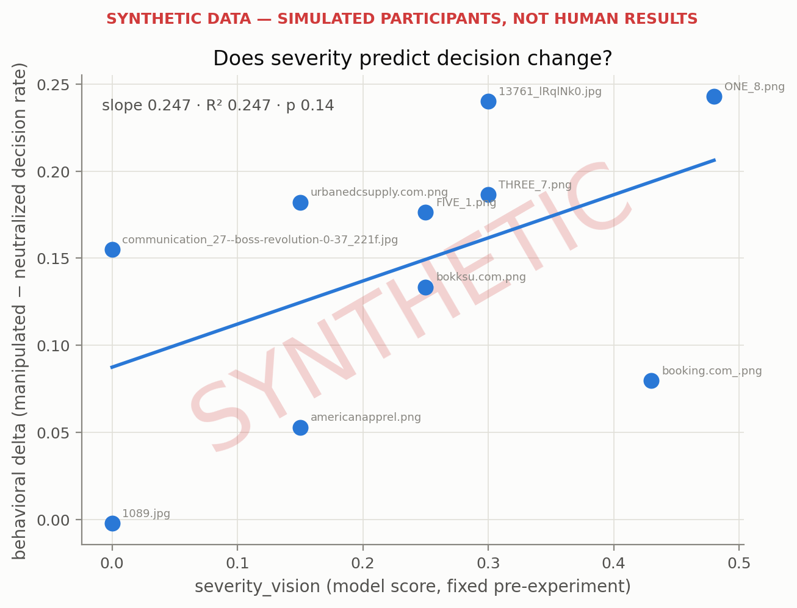

> ⚠ **SYNTHETIC DATA — SIMULATED PARTICIPANTS, NOT HUMAN RESULTS**
>
> Responses were generated by `src/synthetic_participants.py` with a planted effect; this report validates the apparatus, not any hypothesis about people.

# Severity vs behavior

Generated 2026-07-19 05:43 · 3000 responses ({'synthetic': 3000}) · 3000 used across 10 screens

Per screen: behavioral delta = decision rate under the manipulated screen minus under its neutralized counterpart. The delta is regressed on the screen's severity score (fixed before any behavior was collected).

## Regressions

| regressor | role | slope | R² | p | n screens |
|---|---|---|---|---|---|
| severity_vision | **primary** (the claim under test) | 0.247 | 0.247 | 0.14 | 10 |
| severity_text | robustness (text modality) | 0.101 | 0.078 | 0.43 | 10 |
| severity_vision_alt | weight sensitivity (other=0.9) | 0.231 | 0.257 | 0.14 | 10 |

## Per-screen deltas

| screen_id | severity_vision | rate manip | rate neutral | delta | n manip | n neutral |
|---|---|---|---|---|---|---|
| 1089.jpg | 0.000 | 0.272 | 0.274 | -0.002 | 136 | 164 |
| communication_27--boss-revolution-0-37_221f.jpg | 0.000 | 0.373 | 0.218 | +0.155 | 153 | 147 |
| urbanedcsupply.com.png | 0.150 | 0.427 | 0.245 | +0.182 | 157 | 143 |
| americanapprel.png | 0.150 | 0.365 | 0.312 | +0.053 | 156 | 144 |
| bokksu.com.png | 0.250 | 0.440 | 0.307 | +0.133 | 150 | 150 |
| FIVE_1.png | 0.250 | 0.480 | 0.304 | +0.176 | 152 | 148 |
| THREE_7.png | 0.300 | 0.452 | 0.266 | +0.186 | 157 | 143 |
| 13761_lRqlNk0.jpg | 0.300 | 0.520 | 0.280 | +0.240 | 150 | 150 |
| booking.com_.png | 0.430 | 0.426 | 0.346 | +0.080 | 141 | 159 |
| ONE_8.png | 0.480 | 0.548 | 0.305 | +0.243 | 146 | 154 |

## Reading the result

- Primary: severity_vision does NOT significantly predict the behavioral delta (slope 0.247, p 0.14).
- The text-severity robustness check agrees in sign (slope 0.101, p 0.43).
- Under the alt potency weights the slope is 0.231 (p 0.14) — conclusions are stable across the weight choice.

> ⚠ **SYNTHETIC DATA — SIMULATED PARTICIPANTS, NOT HUMAN RESULTS**
